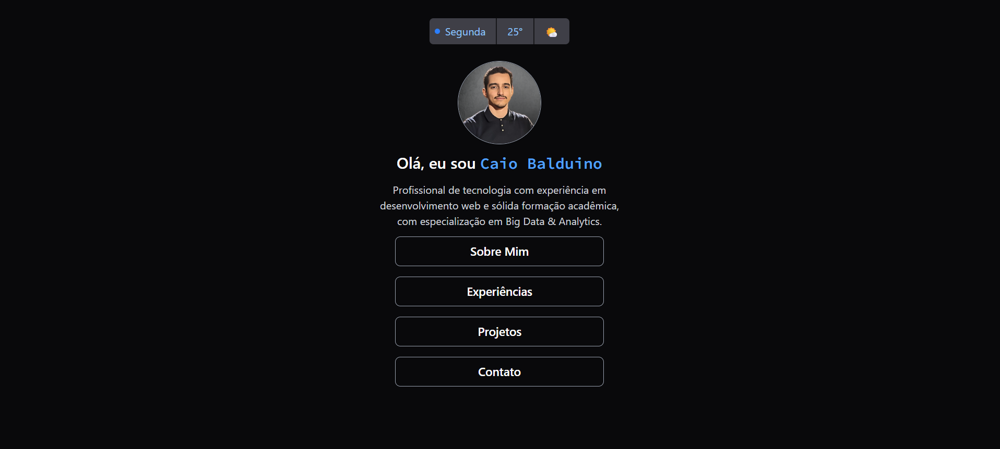

# 🌐 Portfólio Minimalista

Este é o meu portfólio pessoal desenvolvido em **React**, com foco em **minimalismo, performance e internacionalização**.  
O objetivo é apresentar meus projetos de forma simples, elegante e responsiva.

## ✨ Funcionalidades
- Design minimalista e responsivo.
- Suporte a múltiplos idiomas com **i18n** (a linguagem inicial é definida automaticamente pela do navegador do usuário).
- Seção para apresentação pessoal.
- Listagem de projetos com links diretos para repositórios e deploys.
- Entre em contato comigo!

## 🛠️ Tecnologias Utilizadas
- [React](https://react.dev/) – Biblioteca principal para construção da interface.
- [TailwindCSS](https://tailwindcss.com/) – Estilização rápida e responsiva.
- [i18next](https://www.i18next.com/) – Internacionalização (i18n).
- [Vite](https://vitejs.dev/) – Build e ambiente de desenvolvimento rápido.

```plaintext
├── public/             # Arquivos públicos
├── src/
│   ├── assets/         # Imagens e ícones
│   ├── components/     # Componentes reutilizáveis
│   ├── i18n/           # Configuração de idiomas
│   ├── App.jsx         # Página principal
│   └── main.jsx        # Entrada do React
└── package.json
```

### Lista de Projetos
(A lista será atualizada conforme novos projetos forem adicionados independente da linguagem de programação.)